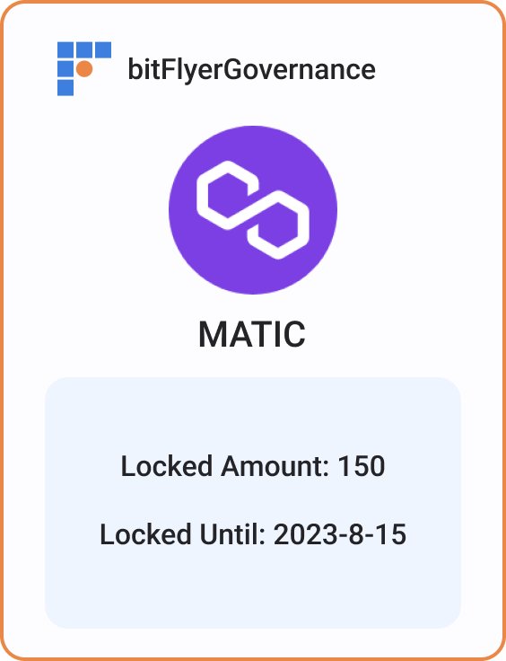
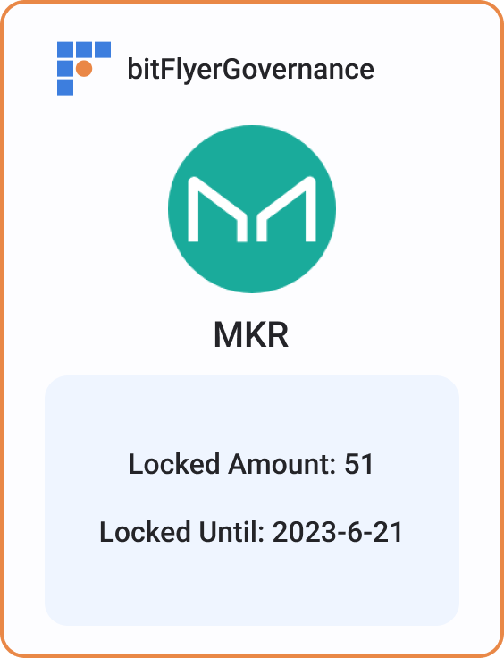
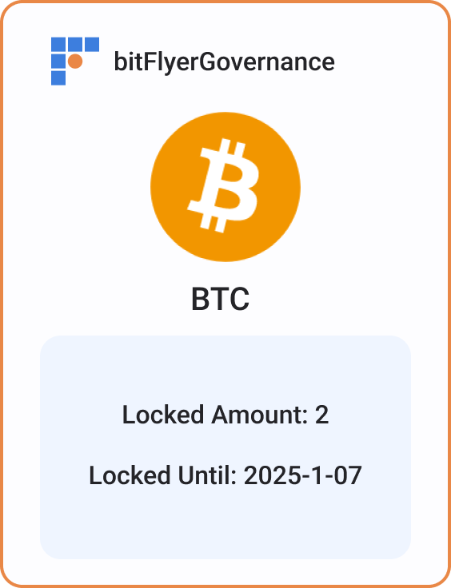

# bitFlyerGovernance
bitFlyerGovernance NFT project fot ETHGlobal Tokyo 2023.

Our project combines proof of reserve with governance to offer a more accessible and secure way for users to participate in governance. With our NFT, users can easily vote on proposals using their exchange-held assets, without needing to worry about security or high network fees. It also provides the possibility of coins not related Ethereum to leverage the governance infrastructures in Ethereum ecosystem.

## Description
Our NFT project aims to set a new standard for cryptocurrency exchanges worldwide, allowing their users to participate in governance activities without the need to withdraw their coins from the exchange, and avoiding high fees and other problems.

Using proof of reserve, users can request exchange to lock any amount of their coins for any duration. An NFT is then minted as proof of ownership and locking of the coins, which can be used on platforms like Snapshot to vote for different projects.

Because the NFT is a certificate of ownership, it doesn't require to be in any specific blockchain, only on those that the voting platform supports. This enables the minting to happen in layer 2 blockchains, for lower fees and efficiency. It also allows users to handle the proof of all the coins they have locked for voting in a single blockchain and wallet.

## How It's Made
In order to achieve proof of reserve, the exchange will create a Merkle tree, where each leaf represents that a user has performed a lock on one of their assets. The exchange will then provide the user with the Merkle proof required for verification, as well as other relevant information (currency, amount, the user's personal address and lock expiry timestamp). The exchange will publish the root of the tree to the smart contracts deployed across the different chains they wish to support.

When a user requests the minting of an NFT, the smart contract will receive the NFT minting call and validate the input, using the Merkle proof provided by the exchange. If the validation is successful, an NFT will be minted with information about the locked assets, such as the currency and amount. This NFT can then be used on any voting platform, such as Snapshot.

## Interface and backend
Combined from repo [https://github.com/bitFlyer-ETHGlobal2023/bitflyer-governance-interface](https://github.com/bitFlyer-ETHGlobal2023/bitflyer-governance-interface)

## Deployed Contracts

* Goerli Testnet
[https://goerli.etherscan.io/address/0xe398ffdd137d6669cf2e11f1face721a9231e220](https://goerli.etherscan.io/address/0xe398ffdd137d6669cf2e11f1face721a9231e220)

* Taiko L2 Testnet
[https://l2explorer.hackathon.taiko.xyz/address/0x1F8D95891766A39739AA656092BaE2C8EA589Bb0/contracts#address-tabs](https://l2explorer.hackathon.taiko.xyz/address/0x1F8D95891766A39739AA656092BaE2C8EA589Bb0/contracts#address-tabs)

* Polygon zkEVM Testnet
[https://explorer.public.zkevm-test.net/address/0x1F8D95891766A39739AA656092BaE2C8EA589Bb0/contracts#address-tabs](https://explorer.public.zkevm-test.net/address/0x1F8D95891766A39739AA656092BaE2C8EA589Bb0/contracts#address-tabs)

* Scroll Alpha Testnet
[https://blockscout.scroll.io/address/0x1F8D95891766A39739AA656092BaE2C8EA589Bb0/contracts#address-tabs](https://blockscout.scroll.io/address/0x1F8D95891766A39739AA656092BaE2C8EA589Bb0/contracts#address-tabs)